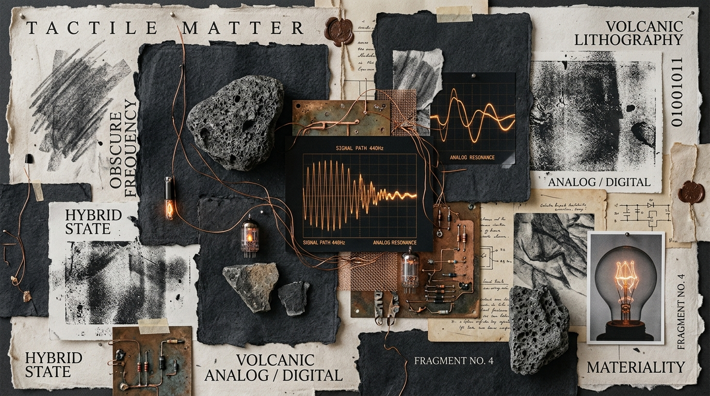
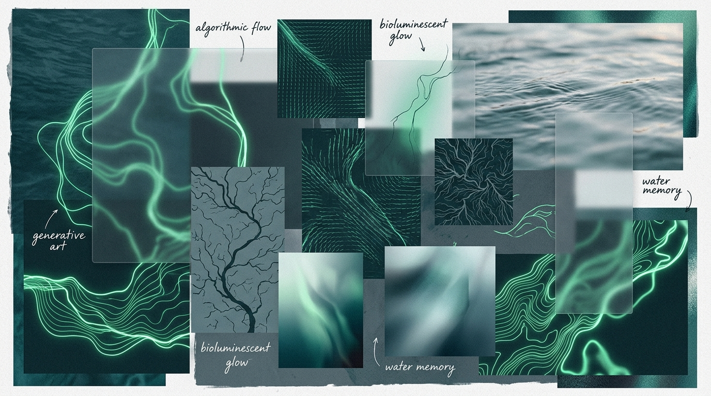
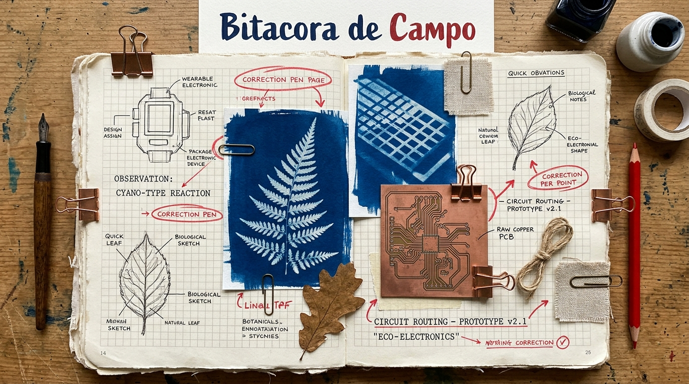
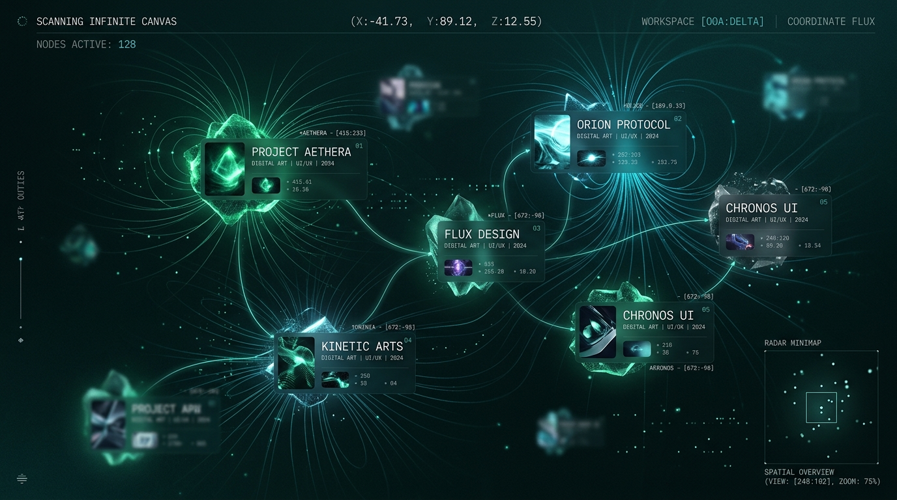
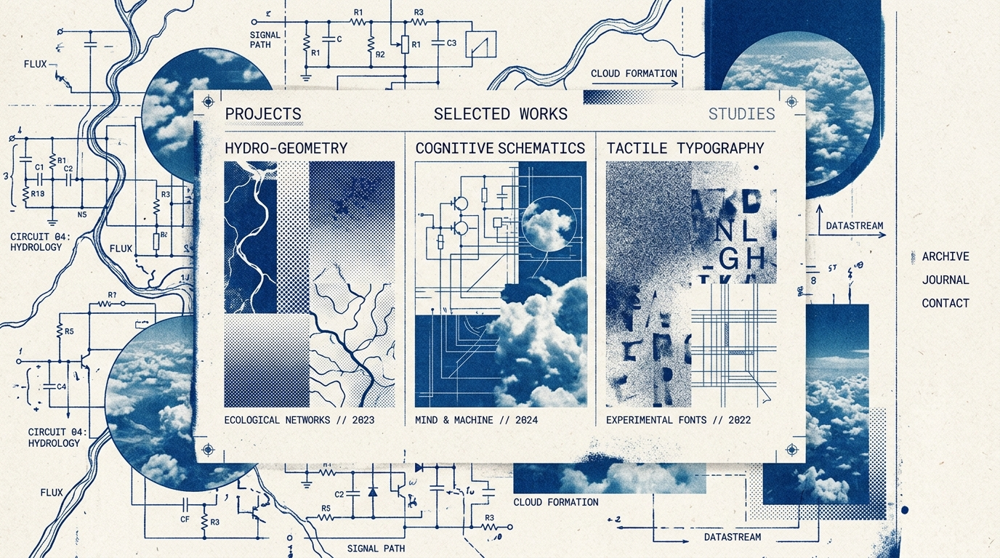
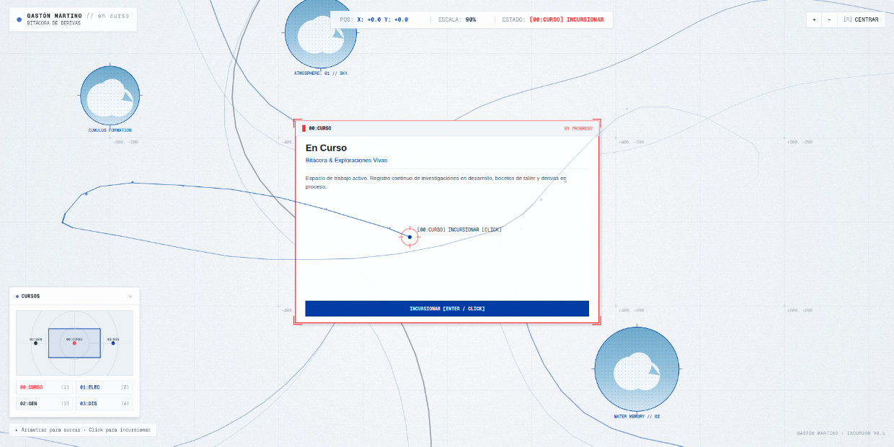

# CURSARIO

## Bitácora de Derivas y Cartografía de Trayectos en Curso

---

> *"Cursar es abrir cauce, atravesar un medio, persistir en un proceso, dejarse llevar y a la vez intervenir en la corriente. Ser un cursor no es solo señalar un píxel en la pantalla: es ser un surcador de materias, un incursionista de ideas, un cartógrafo de derivas y excursos."*

---

## 1\. Manifiesto y Premisa Conceptual

Este proyecto no se concibe como un mero "portfolio" o vitrina estática de resultados cerrados, sino como un **espacio vivo de registro del hacer**, un cauce continuo donde convergen la creación artística electrónica, la gráfica algorítmica, el pensamiento crítico sobre el diseño y la bitácora abierta de las exploraciones en curso.

La columna vertebral conceptual y poética del sitio se articula en torno a la raíz y las derivaciones de la palabra **curso**: cursar, cursor, en curso, cursada, incursionar, excurso.

```
                              [ CURSO DE AGUA ]
                           (fluidez, cauce, corriente)
                                     ▲
                                     │
    [ EN CURSO / IN PROGRESS ] ◄── CURSAR ──► [ CURSADA / FORMACIÓN ]
   (lo vivo, lo no resuelto,         │        (UNTREF, docencia, bagaje)
        la bitácora)                 ▼
                             [ EXCURSO / DERIVA ]
                        (desvíos fértiles, reflexiones)
                                     │
                                     ▼
                            [ EL / LA CURSOR(A) ]
                     (surcador, incursionista, puntero
                       interfaz humano-código-materia)
```

### Polisemia Operativa

1.  **El Curso como Flujo y Recorrido (*Riverbed / Currents*):** Líneas de fuerza, corrientes subterráneas o superficiales que comunican distintas etapas de producción. Las cosas no están aisladas: *siguen su curso*.
2.  **El Cursar como Proceso e Incompletitud (*In Progress / On-going*):** Rescatar el valor del proceso antes de la cristalización final. El sitio le da jerarquía central a lo que se está gestando hoy: notas de laboratorio, fragmentos de código, ensayos de montaje.
3.  **El Cursar como Experiencia y Pedagogía (*Pedagogy & Academics*):** Haber cursado las carreras de Sistemas y Diseño Gráfico y (una gran parte ya de) la Maestría en Artes Electrónicas), cursar la práctica docente cotidiana, acompañar a otros a trazar sus propios cursos.
4.  **El Cursor como Agente y Trazo (*The Pointer / The Furrower*):** El cursor informático (la coordenada que lee e inscribe en la pantalla) fundido con el cursor arcaico: aquel que surca, corre, explora e incursiona. El cursor es la interfaz viva entre la mano, la materia y el código.
5.  **El Excurso como Desvío Fértil (*Excursus*):** El ensayo, la nota al pie, la digresión teórica o poética que enriquece el tronco central.

---

## 2\. Ejes de Contenido y Estructura de la Navegación

La arquitectura de la información se organiza en cuatro cuadrantes o cauces interconectados:

```
┌────────────────────────────────────────┬────────────────────────────────────────┐
│  01. ARTES ELECTRÓNICAS                │  02. GRÁFICA GENERATIVA & CÓDIGO       │
│  • Obras propias de Arte Electrónico   │  • Algoritmos visuales (Processing)    │
│  • Dispositivos, espacialidad,sensórica│  • Tramas, ruido,series estáticas/video│
│  • Hibridaciones físico-digitales      │  • Estudios de movimiento y partículas │
├────────────────────────────────────────┼────────────────────────────────────────┤
│  03. EN CURSO (BITÁCORA / EXPLORACIÓN) │  04. ESCRITOS & REFLEXIÓN DEL DISEÑO   │
│  • Proyecto(s) activo(s) e hipótesis   │  • Ensayos breves y artículos críticos │
│  • Diario de taller / Work in progress │  • Pedagogía, docencia y disciplina    │
│  • Micro-experimentos y pruebas        │  • Excursos, referencias y lecturas    │
└────────────────────────────────────────┴────────────────────────────────────────┘
```

### 01\. Proyectos en el Marco de las Artes Electrónicas

-   **Naturaleza:** Proyectos producidos durante el 2025 y 2026, con anclaje visual, espacial, matérico y electrónico.
-   **Corpus Inicial:** obras producidas durante la Maestría en Artes Electrónicas de la Universidad Nacional de Tres de Febrero.
-   **Tratamiento:** Fichas monográficas ricas: memoria conceptual, esquemas técnicos/circuitos, registros fotográficos y en video de alta calidad, diagramas de flujo y registros sonoros o espaciales.

### 02\. Gráfica Generativa & Código Creativo

-   **Naturaleza:** Exploraciones computacionales generadas entre 2022 y 2024, series de imágenes y piezas audiovisuales (principalmente desarrolladas en Processing / Java / GLSL / p5.js / Shaders).
-   **Tratamiento:** Galería dinámica de tramas, morfologías algorítmicas, variaciones de parámetros y series evolutivas. Posibilidad de ver tanto el artefacto visual como fragmentos de código o lógica del algoritmo.

### 03\. Espacio de Reflexión & Pensamiento de Diseño

-   **Naturaleza:** Ensayos, textos críticos, apuntes de cátedra, reflexiones sobre el rol del diseño contemporáneo, la técnica y la enseñanza.
-   **Tratamiento:** Formato editorial pausado, tipografía legible y refinada, notas al margen, citas vinculadas a las obras y recursos bibliográficos.

### 04\. "En Curso" (Bitácora de Exploraciones Vivas)

-   **Naturaleza:** El corazón presente y mutable del sitio. Una bitácora de investigación actual que puede albergar uno o múltiples proyectos simultáneos en estado de desarrollo.
-   **Tratamiento:** Registro cronológico no lineal: capturas de pantalla, notas rápidas, fragmentos de audio, lecturas disparadoras, errores fértiles (*glitches*, fracasos productivos), avances de prototipos.

---

## 3\. Criterio Estético y Sensibilidad Matérica

### La Tensión: *Materia Háptica x Pulso Electrónico*

El sitio rechaza conscientemente el estándar hiper-higienizado y plano de las plantillas contemporáneas (blanco estéril, tarjetas flotantes genéricas con esquinas redondeadas tipo SaaS). En su lugar, propone una estética **táctil, densa, estratificada y sensible**:

-   **Texturas y Materialidades:** Fondos con grano sutil, microporosidades de papel y fibra, tramas de impresión, superposiciones de veladuras, emulsiones, superficies líticas y sedimentarias.
-   **Intromisiones Electrónicas:** Ruidos de señal, fósforo verde/ámbar atenuado, retículas de fósforo, trazos vectoriales delgados, interferencias electromagnéticas estilizadas, fuentes monoespaciadas combinadas con tipografías seriffadas de corte editorial.
-   **El Cursor Personalizado:** El puntero del mouse como una presencia activa, sensible al contexto (cambia de estado según el medio que atraviesa: surca, mide, pulsa, deja rastro o distorsiona suavemente la trama subyacente).

---

## 4\. Tres Propuestas de Moodboard / Direcciones de Arte

---

### Moodboard A: *Sedimento & Oscilograma (La Geología Digital)*

> **Idea rectora:** La sedimentación del tiempo geológico/analógico interceptada por la vibración de una señal electrónica de baja frecuencia.



```
[ Paleta de Color ]
• Fondo Primario:  #181715 (Grafito / Ceniza volcánica profunda)
• Soporte Claro:   #EAE3D2 (Papel verjurado crudo / Hueso)
• Tinta Base:      #2A2723 (Bistre / Carbón prensado)
• Acento Señal:    #D4AF37 / #E67E22 (Ámbar de bulbo / Resina cálida)
• Trazo Eléctrico: #4ECDC4 (Cian de fósforo atenuado / Cobre oxidado)
```

-   **Tipografía:**
    -   *Titulares:* Serif humanista con carácter escultórico y textura de grabado (ej. *Editorial New*, *Fraunces* o *Cormorant Garamond*).
    -   *Datos / Código / Metadatos:* Monospace técnico de precisión suiza (ej. *Space Mono*, *JetBrains Mono*, *Fragment Mono*).
-   **Texturas y Capas:**
    -   Pátinas de papel fotográfico mate envejecido, escaneos de litografía a alta resolución.
    -   Superposición de ondas senoidales vectoriales ultra-finas (0.5px) y lecturas de coordenadas.
-   **Interacción:**
    -   Al mover el cursor, se genera una pequeña ondulación de frecuencia en las líneas vectoriales de fondo.
    -   Las imágenes cargan con un ligero efecto de barrido catódico suave.

---

### Moodboard B: *Cauce & Tensión de Superficie (La Hidrografía del Código)*

> **Idea rectora:** Cursos de agua, flujos laminares y turbulencias generativas. La pantalla como una membrana líquida donde la gráfica generativa de Processing cobra vida orgánica.



```
[ Paleta de Color ]
• Fondo Primario:  #0D1117 / #081B1B (Noche abisal / Verde petróleo profundo)
• Soporte Claro:   #F0F4F1 (Niebla matinal / Espuma de río)
• Tinta Base:      #1C2A27 (Alga seca / Musgo húmedo)
• Acento Flujo:    #00FF87 (Bioluminiscencia / Fósforo verde esmeralda)
• Tono de Unión:   #708090 (Pizarra azulada / Grafito húmedo)
```

-   **Tipografía:**
    -   *Titulares:* Tipografía contemporánea de contraste variable, con ligaduras fluidas que remiten a corrientes continuas (ej. *PP Woodland*, *Ogg*, *Newsreader* en itálica fluida).
    -   *Lectura:* Sans humanista neutra y cálida (ej. *Instrument Sans*, *Inter* suavizado).
-   **Texturas y Capas:**
    -   Patrones moiré animados suavemente, mapas topográficos de curvas de nivel generadas por ruido Perlin.
    -   Capas de vidrio deslustrado (*frosted glass*) que velan el contenido posterior con efecto de refracción líquida.
-   **Interacción:**
    -   Navegación horizontal o en diagrama de cursos que se ramifican (como afluentes y deltas).
    -   El cursor actúa como un emisor de partículas que interactúa con la viscosidad de los elementos.

---

### Moodboard C: *Bitácora de Campo & Circuito Impreso (El Taller del Incursionista)*

> **Idea rectora:** El cuaderno de notas de un investigador/docente/artista que cruza botánica, cables, estaño, cianotipias y cuadernos cuadriculados de laboratorio.



```
[ Paleta de Color ]
• Fondo Primario:  #F7F4EB (Papel de algodón milimetrado / Isotipo crema)
• Tinta Técnica:   #1A2238 (Azul cianotipia / Tinta china de estilográfica)
• Tono de Taller:  #B86B43 (Cobre crudo / Terracota / Baquelita)
• Acento Alerta:   #E63946 (Marcador rojo de corrección / LED indicador)
• Soporte Oscuro:  #161925 (Azul noche de circuito)
```

-   **Tipografía:**
    -   *Titulares y Ensayos:* Serif de máquina de escribir o romana transicional académica (ej. *PT Serif*, *Besley*, *IBM Plex Serif*).
    -   *Notas al Margen y Bitácora:* Monoespaciada con estilo de terminal / máquina de escribir moderna (*IBM Plex Mono* o *Commit Mono*).
-   **Texturas y Capas:**
    -   Cuadrículas tenues de 5mm, sellos de archivo, notas adhesivas digitales con anotaciones manuscritas escaneadas.
    -   Esquemas esquemáticos de placas Arduino/Processing conviviendo con fotos analógicas de grano grueso y recortes de libros de teoría del diseño.
-   **Interacción:**
    -   Notas al margen que se despliegan en el lienzo lateral.
    -   Visualización en capas (*layers*) activables por el usuario (Capa de Materia, Capa de Circuito, Capa de Texto).

---

---

## 5\. Actualización de la Dirección Estética: Hidrografía & Campos Electromagnéticos

*(Evolución y maduración del Moodboard B)*

Tras la evaluación de los tres caminos, se establece como dirección nuclear la **hidrografía generativa combinada con líneas de campos electromagnéticos**:

1.  **Fluidez y Cursos de Agua:** El agua como conductora, como cauce continuo y como memoria de la corriente.
2.  **Turbulencia y Resistencia:** No es un flujo homogéneo ni estéril; incorpora zonas de choque, remolinos algorítmicos, ruido y perturbaciones.
3.  **Líneas de Fuerza y Magnetismo:** La convergencia natural entre el paisaje hídrico y el circuito electrónico: líneas de flujo que recuerdan a campos magnéticos, oscilaciones de señal y trazas vectoriales en tiempo real.

```
                  ┌────────────────────────────────────────┐
                  │          DIRECCIÓN CONSOLIDADA         │
                  │   HIDROGRAFÍA + CAMPO ELECTROMAGNÉTICO │
                  └───────────────────┬────────────────────┘
                                      │
           ┌──────────────────────────┴──────────────────────────┐
           ▼                                                     ▼
┌──────────────────────┐                              ┌──────────────────────┐
│  POÉTICA MATÉRICA    │                              │  POÉTICA TECNOLÓGICA │
│ • Cursos y deltas    │                              │ • Campos vectoriales │
│ • Turbulencias/ruido │                              │ • Pulsos y señales   │
│ • Viscosidad y agua  │                              │ • Sensórica y código │
└──────────────────────┘                              └──────────────────────┘
```

---

### 5.1. Sistema Tipográfico: Contemporáneo, Técnico y Digital

-   **Criterio de exclusión:**
    -   Se descartan las tipografías estilo *script* / caligráficas (por riesgo de ornamento innecesario).
    -   Se descarta el recurso *pixel-art* / 8-bit / arcade (para evitar la nostalgia retro simplista).
-   **Criterio de adopción:** Tipografía con rigor proyectual, contemporánea, nítida y con ADN digital contemporáneo (micro-cortes mecánicos, proporciones geométricas de pantalla, máxima legibilidad en interfaces complejas).

```
┌─────────────────────────┬────────────────────────────────────────────────────────┐
│ ROL TIPOGRÁFICO         │ PROPUESTA / FUENTES RECOMENDADAS                       │
├─────────────────────────┼────────────────────────────────────────────────────────┤
│ Titulares & Identidad   │ • Geist Sans (Vercel / Basel)                          │
│                         │ • PP Neue Montreal (Pangram Pangram)                   │
│                         │ • Aeonik / Söhne (Klim Type Foundry)                   │
│                         │ • Rasgos: Neo-grotesca técnica, neutra pero punzante   │
├─────────────────────────┼────────────────────────────────────────────────────────┤
│ Cuerpo de Lectura /     │ • Inter Display / Geist Sans Regular                   │
│ Ensayos de Diseño       │ • Rasgos: Excelente espaciado y ritmo para lectura     │
├─────────────────────────┼────────────────────────────────────────────────────────┤
│ Metadatos, Coordenadas, │ • Geist Mono / Commit Mono                             │
│ Código & Bitácora       │ • JetBrains Mono / Space Mono                          │
│                         │ • Rasgos: Precisión ingenieril, parámetros, variables  │
└─────────────────────────┴────────────────────────────────────────────────────────┘
```

---

### 5.2. Sistema Cromático Expandido & Acentos

La paleta trasciende el monocroma simple mediante una **escala graduada de verdes hidrofóbicos/bioluminiscentes** combinada con **fondos de absorción de luz** y **acentos complementarios de polaridad**:

```
[ ESCALA DE FONDOS Y PROFUNDIDAD ]
  #080E0D  ■  Abismo / Negro Hidrográfico (Fondo base primordial)
  #0E1716  ■  Petróleo Profundo (Superficie de contenedores / Módulos)
  #192826  ■  Pizarra Líquida (Bordes, líneas de retícula y divisores)
  #F2F6F5  ■  Niebla de Río (Soporte claro para modo inverso o citas)

[ FAMILIA DE VERDES: FLUJO, MEMBRANA Y SEÑAL ]
  #00FF87  ■  Verde Fósforo / Bioluminiscencia (Líneas de corriente activas, foco)
  #3CD099  ■  Verde Esmeralda Técnico (Hover, estados secundarios, links)
  #528578  ■  Verde Musgo / Salvia Atenuado (Tipografía de metadatos, trazos pasivos)
  #9BE7D2  ■  Menta Glacial / Vapor (Resaltados tenues, veladuras)

[ ACENTOS COMPLEMENTARIOS: POLARIDAD & CALIDEZ ]
  #00B4D8  ■  Cian Eléctrico / Polaridad (Campos magnéticos, tensión de superficie)
  #D97736  ■  Cobre / Ámbar de Filamento (Acento térmico: calor de circuito, hardware)
  #E63946  ■  Rojo Carmesí / Registro Vivo (Indicador de "En Curso", bitácora activa)
```

---

## 6\. Patrón de Diseño: El Canvas Infinito (Territorio Surcable)

### 6.1. Canvas Inifito y Pertinencia Conceptual

> **¿Es posible implementar un Canvas Infinito para encarnar la metáfora de *CURSAR* y *SURCAR*?.**

En lugar de confinar la producción a un scroll vertical tradicional, el sitio se despliega como un **plano bidimensional navegable**, un mapa hidrográfico donde los cuatro ejes de contenido son **regiones/archipiélagos interconectados por corrientes de datos y líneas de fuerza**.



```
                           [ CANVAS INFINITO: TOPOLOGÍA ]

                                      ▲ [NORTE]
                                (Artes Electrónicas)
                                  UNTREF • 3 Obras
                                       ▲
                                       │ ── Corriente de hardware
      [OESTE]                          │                          [ESTE]
  (Gráfica Generativa) ◄─────── [NODO CENTRAL] ───────► (Ensayos & Pensamiento)
   Processing • GLSL         "EN CURSO" / BITÁCORA         Diseño & Docencia
        Series                         │                         Crítica
                                       │ ── Corriente teórica
                                       ▼
                                  [SUR / DELTA]
                             (Archivo de Derivas &
                                   Excursos)
```

---

### 6.2. Arquitectura de Navegación Dual: *Surcar - Profundizar*

Uno de los grandes riesgos de los canvas infinitos es la desorientación. Para garantizar una experiencia memorable y a la vez accesible, se implementa una **arquitectura en dos capas**:

```
┌─────────────────────────────────────────────────────────────────────────────┐
│ 1. MODO PANORÁMICO: EL SURCADOR (Spatial Canvas)                            │
│ • Desplazamiento libre (Pan & Zoom) con mouse, trackpad o drag.             │
│ • Fondo vivo: Campo vectorial de líneas de flujo generadas por algoritmo.   │
│ • Nodos flotantes con previsualizaciones dinámicas (mini-videos, código).   │
│ • Minimapa / Radar hidrográfico en la esquina con coordenadas X/Y en vivo.  │
└──────────────────────────────────────┬──────────────────────────────────────┘
                                       │
                         [ Click en un nodo/proyecto ]
                                       │
                                       ▼
┌─────────────────────────────────────────────────────────────────────────────┐
│ 2. MODO PROFUNDIZACIÓN: LECTURA EDITORIAL (Drawer / Spatial Overlay)        │
│ • El lienzo se atenúa suavemente y se enfoca en el proyecto seleccionado.   │
│ • Se abre un panel lateral o vista editorial de ancho completo.             │
│ • Lectura pausada, reproducción de video en alta definición, ensayos largos.│
│ • La URL se actualiza (Deep linking: /obras/untref-01) para compartir.      │
│ • Botón de retorno al mapa o "seguir la corriente hacia el proyecto afín".  │
└─────────────────────────────────────────────────────────────────────────────┘
```

---

### 6.3. El Cursor como Instrumento Sensible

El cursor del mouse deja de ser la flecha genérica del sistema operativo y asume roles activos según la coordenada:

-   **En el vacío del lienzo:** Puntero vectorial con estela de perturbación (interactúa con las partículas y líneas del fondo como si empujara agua).
-   **Sobre Obras/Proyectos:** Adopta una retícula con lectura de coordenadas y oscilación de frecuencia.
-   **Sobre Gráfica Generativa:** Muestra un micro-cursor con parámetros interactivos ajustables.
-   **Sobre Ensayos de Diseño:** Se transforma en una barra de precisión tipográfica de lectura.

---

### 6.4. Viabilidad Técnica y Stack de Implementación

Para asegurar carga ultrarrápida, SEO perfecto y 60 FPS en el canvas:

1.  **Framework:** **Astro** (Generación estática ultra-liviana con islas interactivas).
2.  **Motor del Canvas Infinito:**
    -   **Opción Ligera (Recomendada):** DOM Virtualizado + Transformaciones de Matriz CSS aceleradas por GPU (`matrix3d`) + Canvas HTML5 2D / WebGL liviano para el fondo reactivo de partículas/líneas de campo.
    -   **Librerías de apoyo:** `@use-gesture` / `panzoom` o implementación a medida optimizada con `requestAnimationFrame`.
3.  **Modo Accesible / Mobile Responsive:**
    -   En dispositivos móviles (o mediante un switch accesible en el menú), el sitio ofrece un **"Modo Flujo Continuo"** (vista lineal / lista depurada), permitiendo navegar todo el contenido sin fricción táctil.

---

## 7\. Hoja de Ruta / Plan de Proyecto (Actualizado)

```
[ FASE 1: Fundamentación & Curaduría de Contenidos ]
  ├── [x] Manifiesto conceptual y definición de los 4 ejes
  ├── [x] Elección estética (Moodboard B expandido + Campos Magnéticos)
  ├── [x] Definición tipográfica y paleta cromática expandida
  ├── [x] Especificación de la arquitectura del Canvas Infinito
  ├── [ ] Relevamiento detallado de las obras de AE (título, ficha, medios)
  ├── [ ] Selección de piezas de Processing (imágenes fijas, videos/loops)
  └── [ ] Recopilación de textos y definición del primer proyecto "En curso"

[ FASE 2: Prototipado del Canvas & Sistema de Interacción ]
  ├── Prototipo interactivo del Lienzo Infinito (Pan, Zoom, límites elásticos)
  ├── Desarrollo del shader / canvas de fondo (campo de fuerzas reactivo al cursor)
  ├── Maquetado de las Islas de Contenido y el Minimapa de navegación
  └── Implementación del sistema de Cursor inteligente y transiciones de estado

[ FASE 3: Sistema Editorial & Modo Profundización ]
  ├── Desarrollo del Drawer/Modal editorial para lectura inmersiva
  ├── Sistema de Deep Linking y enrutamiento en Astro (URLs directas por obra)
  ├── Visores de código interactivo y reproductores multimedia optimizados
  └── Implementación del "Modo Flujo Continuo" para mobile y accesibilidad

[ FASE 4: Carga y Ensamblaje de Obras ]
  ├── Montaje de las obras de arte electrónico en el canvas
  ├── Montaje del archivo generativo de Processing
  ├── Publicación de ensayos de diseño y reflexiones pedagógicas
  └── Configuración de la bitácora viva "En Curso"

[ FASE 5: Pulido Sensible, Rendimiento & Despliegue ]
  ├── Optimización de texturas, shaders y consumo de GPU/batería
  ├── Testing cross-browser y calibración de gestos táctiles
  └── Publicación y puesta en marcha del dominio
```

---

## 8\. Evolución Estética Definitiva: "Cartografía Sensible, Azules de Tinta & Circuitos de Papel"

*(Análisis profundo de las 4 imágenes de referencia y cambio de paradigma estético)*

A partir de la revisión de cuatro nuevas referencias visuales, se redefine radicalmente la atmósfera del sitio: **se abandona el paradigma oscuro/HUD hipertecnológico ("cyber/sci-fi") para abrazar un territorio luminoso, táctil, editorial y sensible**, donde el azul de imprenta, el grano de fotocopia, el papel de dibujo y las ventanas de cielo/nubes construyen la verdadera fluidez de los cursos.



---

### 8.1. Deconstrucción y Aprendizaje desde las Referencias

```
┌────────────────────────────────────────┬────────────────────────────────────────┐
│ REFERENCIA 01: Collage & Xerox Grano   │ REFERENCIA 02: Tapiz Vectorial Klein   │
│ • Soporte de papel claro con textura.  │ • Azul Cobalto / Klein eléctrico puro. │
│ • Grano de fotocopia / risografía.     │ • Tensión matriz digital vs folklore.  │
│ • Recorte fotográfico en azul cobalto. │ • Motivos que crecen como afluentes.   │
│ • Micro-acentos en rojo/naranja cinta. │ • Fondo níveo / niebla inmaculada.     │
├────────────────────────────────────────┼────────────────────────────────────────┤
│ REFERENCIA 03: Cartografía Eclipsada   │ REFERENCIA 04: Esquema Circuito + Río  │
│ • Mapa aéreo y niebla atmosférica.     │ • Fusión literal: Circuito = Costa/Río.│
│ • Cursos y deltas topográficos tenues. │ • Ventana de fotografía de cielo/nubes.│
│ • Tipografía rotunda con sombra halo.  │ • Trazas técnicas con rigor gráfico.   │
│ • Sellos botánicos indexados.          │ • Papel técnico milimetrado claro.     │
└────────────────────────────────────────┴────────────────────────────────────────┘
```

1.  **La luz del soporte (Papel y Niebla):** El fondo ya no es negro abisal; es un soporte claro de papel de grabado o plano de arquitecto (`#F7F8FA` / `#EFF1F5`), cálido, poroso y respirable.
2.  **La Familia de los Azules de Tinta:** El azul no se utiliza como un neón brillante, sino como **pigmento, tinta risográfica, cianotipia y cielo**.
3.  **El Esquema Electrónico como Hidrografía:** Como enseña la *Referencia 04*, los circuitos no son fríos chips, sino mapas de navegación, líneas de costa y afluentes que conectan memorias con ideas.
4.  **Ventanas de Naturaleza y Atmósfera:** Recortes fotográficos de nubes, cielo y agua en semitonos (*halftone/dithering*) que traen aire fresco y sensibilidad orgánica a la pantalla.

---

### 8.2. El Nuevo Sistema Cromático: *Azules, Papel & Acentos de Taller*

```
[ SOPORTE Y MATERIA BASE ]
  #F6F7F9  ■  Papel de Plano / Algodón Crudo (Lienzo espacial principal)
  #E8ECF2  ■  Niebla de Río / Papel Vegetal (Superficies de tarjetas y paneles)
  #D2D8E2  ■  Pizarra Clara / Grafito Tenue (Retícula, cotas y líneas de marco)

[ GAMA DE AZULES: TINTA, CORRIENTE & ATMÓSFERA ]
  #0038A8  ■  Azul Cobalto / Tinta Risográfica (Trazos de flujo, nodos activos, enlaces)
  #16253D  ■  Azul Cianotipia / Marino de Esquema (Circuitos, tipografía de metadatos)
  #7EA8CE  ■  Azul Cielo / Niebla Hidrográfica (Ventanas de cielo, veladuras, halo)
  #D8E5F3  ■  Agua Glacial / Reflejo (Fondos suaves de selección)

[ TINTA DE LECTURA ]
  #1A1C20  ■  Carbón de Imprenta (Tipografía editorial para lectura descansada)

[ ACENTOS TÁCTILES SUTILES (REFERENCIAS 1 & 4) ]
  #E03E2D  ■  Bermejo / Lacre / Marcador Rojo (Puntos de anclaje, bitácora "En Curso")
  #E5C887  ■  Cinta Masking / Ocre Pálido (Notas de taller, pestañas activables)
```

---

### 8.3. La Nueva Experiencia del Canvas Infinito Sensible

El lienzo infinito se transforma en una **Mesa de Dibujo / Pliego Cartográfico Digital**:

1.  **Textura Háptica de Fondo:** Grano sutil de papel risográfico y retícula técnica casi imperceptible que acompaña el desplazamiento (pan).
2.  **Los Cursos como Trazas de Tinta:** Líneas de agua y circuitos dibujados en azul cobalto puro que fluyen suavemente entre las 4 áreas de contenido.
3.  **Módulos con Ventanas Fotográficas:** Las tarjetas de las obras y reflexiones no son cajas grises; son composiciones con ventanas de cielo/nubes, diagramas electrónicos y tramas de semitonos (halftone).
4.  **El Cursor del Incursionista:** Una mira técnica en azul cobalto con estela tenue de tinta que reacciona a la viscosidad de los elementos al sobrevolarlos.

---

## 9\. Hoja de Ruta / Plan de Proyecto (Actualizado)

```
[ FASE 1: Fundamentación & Curaduría de Contenidos ]
  ├── [x] Manifiesto conceptual y definición de los 4 ejes
  ├── [x] Evolución estética definitiva: Azules de Tinta, Papel & Circuitos Sensibles
  ├── [x] Definición tipográfica (Neo-grotesca técnica + Monospace) y paleta cromática
  ├── [x] Especificación de la arquitectura del Canvas Infinito sensible
  ├── [ ] Relevamiento detallado de las obras de AE (título, ficha, medios)
  ├── [ ] Selección de piezas de Processing (imágenes fijas, videos/loops)
  └── [ ] Recopilación de textos y definición del primer proyecto "En curso"

[ FASE 2: Prototipado del Canvas Sensible & Sistema de Interacción ]
  ├── Prototipo interactivo del Lienzo Infinito sobre fondo claro de papel
  ├── Generación del flujo de líneas de circuitos/hidrografía en azul cobalto
  ├── Maquetado de las Islas de Contenido con ventanas de nubes y semitonos
  └── Implementación del Cursor dinámico con estela de tinta

[ FASE 3: Sistema Editorial & Modo Profundización ]
  ├── Desarrollo del Drawer/Modal editorial para lectura inmersiva
  ├── Sistema de Deep Linking y enrutamiento en Astro (URLs directas por obra)
  ├── Visores de código interactivo y reproductores multimedia optimizados
  └── Implementación del "Modo Flujo Continuo" para mobile y accesibilidad

[ FASE 4: Carga y Ensamblaje de Obras ]
  ├── Montaje de las 3 obras UNTREF
  ├── Montaje del archivo generativo de Processing
  ├── Publicación de ensayos de diseño y reflexiones pedagógicas
  └── Configuración de la bitácora viva "En Curso"

[ FASE 5: Pulido Sensible, Rendimiento & Despliegue ]
  ├── Optimización de texturas de papel, shaders livianos y consumo de GPU
  ├── Testing cross-browser y calibración de gestos táctiles
  └── Publicación y puesta en marcha del dominio
```

---

## 10\. Registro de la Primera Versión de la Implementación del Sitio



> Diseño preliminar de la página principal (sin contenidos, aún). Cada ventana representa un posible curso a recorrer. Abajo, a la izquierda un mapa miniatura (*colapsable*) que orienta la navegación.

### 1\. Sistema de Estilos y Paleta Cromática (`tailwind.config.mjs`)

El diseño refleja fielmente la dirección estética *"Cartografía Sensible, Azules de Tinta & Circuitos de Papel"*:

-   **Familia `paper`:** `#FAFBFD`, `#F5F7FA` (base), `#EDF1F5` (pliego), `#F2EFEB` (papel cálido).
-   **Familia `ink`:** `#1A1C20` (carbón imprenta), `#4A505C` (secundario), `#D0D6E2` (líneas/bordes).
-   **Familia `cobalt`:** `#0038A8` (tinta cobalto principal), `#002FA7` (Klein), `#002270`.
-   **Familia `cyanotype`:** `#16253D` (marino cianotipia/circuitos).
-   **Familia `river`:** `#D8E5F3` (agua/reflejo), `#7EA8CE` (azul cielo/nubes).
-   **Familia `accent`:** `#E03E2D` (lacre/vermellón "En curso"), `#E5C887` (cinta masking), `#D97736` (cobre).
-   **Tipografías:** `Geist / PP Neue Montreal / Inter` para UI y lectura; `Geist Mono / Commit Mono` para coordenadas y metadatos técnicos.

---

### 2\. Motor 2D del Canvas Infinito (Carpeta `src/engine/`)

Construido modularmente en TypeScript nativo a 60 FPS sobre HTML5 Canvas 2D:

-   **`Camera.ts`:** Maneja las transformaciones entre Coordenadas de Pantalla y Coordenadas del Mundo. Inercia de arrastre (*momentum pan*) y zoom fluido (*lerp/spring*) centrado en el cursor (rango `0.25x` a `2.5x`).
-   **`InkCursor.ts`:** Reemplaza el puntero por una mira técnica reticular en Azul Cobalto / Vermellón. Dibuja una cinta de tinta fluida cuya línea cambia de grosor según la velocidad del trazo, emitiendo salpicaduras de micro-gotas al moverlo rápidamente.
-   **`GenerativeSurface.ts`:**
    -   *Textura de Papel:* Genera en caché un patrón de micro-grano risográfico.
    -   *Nivel 1 (Macro Cartografía):* Dibuja la retícula técnica con coordenadas en tiempo real (`+X, +Y`), meandros de ríos generados procedimentalmente con `simplex-noise`, esquemáticos de circuitos integrados con pines, ventanas circulares fotográficas de cielo/nubes con tramado en semitono (*halftone*) y las 4 "islas" cartográficas principales con corchetes de plano técnico y botones *"INCURSIONAR"*.
    -   *Nivel 2 (Local Deriva):* Retícula fina, río de flujo sinuoso que conecta las tarjetas (*items*) de la deriva activa y marca de agua.
-   **`SpatialZones.ts`:** Define la espacialidad de las 4 regiones principales:
    -   `00:CURSO` — **En Curso** `(0, 0)` (con 3 registros de taller).
    -   `01:ELEC` — **Artes Electrónicas UNTREF** `(0, -1400)` (con las 3 obras principales).
    -   `02:GEN` — **Gráfica Generativa** `(-1600, 0)` (con 3 series de Processing/GLSL).
    -   `03:DIS` — **Pensamiento & Diseño** `(1600, 0)` (con 3 ensayos/textos).
-   **`CanvasController.ts`:** Orquesta los eventos (ratón, rueda, *pinch-to-zoom* en touch, atajos de teclado `[ESC]`, `[R]`, `[1]..[4]`, `[+]`, `[-]`). Realiza el *hit-testing* en tiempo real para hover sobre nodos e items, y maneja las transiciones cinemáticas entre Nivel Macro y Nivel Deriva (`incursionar()` y `exitDeriva()`).

---

### 3\. Componentes e Interfaz UI Astro (Carpeta `src/components/` y `src/layouts/`)

-   **`Layout.astro`:** Configuración base con Google Fonts, meta-etiquetas y deshabilitación del cursor por defecto en el canvas.
-   **`InfiniteCanvas.astro`:** Componente raíz de la vista que contiene el `<canvas id="infinite-canvas">`, la cortina de transición suave entre niveles (`#transition-curtain`) e inicializa el `CanvasController`.
-   **`HUD.astro`:** Barra flotante de telemetría superior que muestra coordenadas en vivo (`POS: X, Y`), nivel de zoom (`ESCALA: %`), estado del nodo activo, botón `← VOLVER [ESC]` y controles de zoom (+, -, centrar).
-   **`RadarMinimap.astro`:** Widget minimapa radar colapsable en la esquina inferior izquierda. Dibuja en un mini-canvas la posición de la cámara en relación con los nodos, botones de vuelo rápido `[1]` a `[4]` e instrucciones interactivas.

---

## 11\. Estado Actual de la Implementación

La primera implementación ya no es solamente un mockup visual: el sitio cuenta con una navegación espacial funcional y con contenido editorial real cargado desde Markdown. La página raíz (`/`) presenta la cartografía macro; cada región puede abrirse como una deriva local; y cada subcurso dispone de una página propia generada de forma estática.

### 11\.1. Stack y configuración

-   **Astro 5** como framework y generador de páginas estáticas.
-   **TypeScript** en modo estricto, con alias de imports `@/*` configurado en `tsconfig.json`.
-   **Tailwind CSS 3** integrado mediante `@astrojs/tailwind`.
-   **HTML Canvas 2D nativo** para el motor espacial y la superficie generativa.
-   **`simplex-noise`** para la generación de corrientes y perturbaciones cartográficas.
-   **Lucide** y `tailwind-merge` disponibles como dependencias de interfaz.
-   Servidor de desarrollo configurado en el puerto `3000`, accesible desde otros dispositivos de la red (`host: true`).

Los comandos principales son:

```bash
npm run dev       # desarrollo
npm run build     # compilación estática
npm run preview   # previsualización de la compilación
```

### 11\.2. Organización del código

```text
src/
├── components/       # Canvas, tarjetas, HUD y minimapa
├── data/             # Catálogo tipado de subcursos
├── engine/           # Cámara, interacción, cursor y superficie generativa
├── layouts/          # Documento base, metadatos y transiciones de página
├── pages/            # Inicio y rutas dinámicas de cada subcurso
└── utils/            # Conversión del Markdown editorial a HTML

public/
├── curso00/          # Bitácora En Curso
├── curso01/          # Artes Electrónicas / UNTREF
├── curso02/          # Gráfica Generativa
└── curso03/          # Pensamiento & Diseño
```

`InfiniteCanvas.astro` compone la escena y carga server-side los Markdown de cada curso y subcurso. `CanvasController` conecta el motor con el DOM: el canvas dibuja el territorio, mientras que las tarjetas `IslandCard.astro` se posicionan como una capa HTML superior para conservar legibilidad, imágenes, enlaces y contenido editorial a cualquier escala.

### 11\.3. Modelo de contenidos

El catálogo de `src/data/subcursos.ts` define doce subcursos, tres por cada curso principal:

| Curso | Región | Contenido actual |
| --- | --- | --- |
| `curso00` | `en-curso` | Cinco registros de bitácora y experimentación |
| `curso01` | `untref` | Cinco obras de Artes Electrónicas / MAE |
| `curso02` | `generativa` | Seis series de Processing, gráfica y video |
| `curso03` | `pensamiento` | Tres ensayos, apuntes y manifiestos de diseño |

Cada subcurso tiene una definición tipada —código, título, subtítulo, etiqueta, color, categoría e identificador espacial— y una pareja de archivos Markdown:

-   `contenido-curso.md`: resumen que aparece dentro de la tarjeta espacial.
-   `pagina-curso.md`: contenido de la página editorial individual.

Las imágenes y portadas se sirven desde `public/cursoXX/...`, por lo que mantienen rutas públicas estables y no requieren importación desde los componentes Astro.

El conversor de `src/utils/markdown.ts` es deliberadamente pequeño y controlado: soporta títulos de nivel 1 a 3, párrafos, citas, negrita, cursiva y código inline. No es todavía un procesador Markdown completo; listas, tablas, enlaces y otros recursos quedan como trabajo pendiente si el archivo editorial los necesita.

### 11\.4. Arquitectura de navegación espacial

La navegación se divide en dos niveles:

```text
Nivel macro: cartografía completa
  ├── CURSO:00  En Curso...              ( 0,     0)
  ├── CURSO:01  Artes Electrónicas       ( 0, -1400)
  ├── CURSO:02  Gráfica Generativa       (-1600,  0)
  └── CURSO:03  Pensamiento & Diseño     ( 1600,  0)

Nivel deriva: recorrido local de una región
  └── una cantidad variable de tarjetas de subcurso conectadas por una corriente
```

En el nivel macro, el usuario puede arrastrar el plano, desplazarse entre regiones, usar el radar o seleccionar una isla para `INCURSIONAR`. La cámara conserva coordenadas de mundo independientes de la pantalla y calcula automáticamente un zoom de encuadre para que cada región resulte visible al llegar.

Al entrar en una deriva, la cámara se centra en el sistema local y muestra sus subcursos sobre una retícula fina, unidos por un cauce curvo. La cantidad de tarjetas no está limitada a tres: se determina mediante el arreglo `items` de cada deriva. Las tarjetas locales incluyen imagen, resumen, coordenadas y un enlace `INCURSIONAR [ABRIR]` hacia la página editorial.

### 11\.5. Controles disponibles

| Acción | Escritorio | Touch / interfaz |
| --- | --- | --- |
| Surcar el plano | Arrastrar con el mouse; rueda para desplazar o hacer zoom | Arrastre de un dedo |
| Zoom | Rueda, `+`, `-` o botones del HUD | Pinch con dos dedos |
| Centrar | `R`, `0` o `CENTRAR` | Botón del HUD |
| Ir a una región | `1`–`4` o botones del radar | Botones del radar |
| Abrir una región | Click sobre una isla, `ENTER` o `INCURSIONAR` | Toque sobre el botón o la isla |
| Volver al nivel macro | `ESC` o `← VOLVER` | Botón del HUD |
| Abrir un subcurso | `INCURSIONAR [ABRIR]` | Enlace de la tarjeta |

El radar es colapsable y cambia su información según el nivel activo. En macro muestra las cuatro regiones y el encuadre de la cámara; dentro de una deriva muestra las tres tarjetas locales y el encuadre correspondiente.

### 11\.6. Renderizado e interacción

-   `Camera.ts` transforma coordenadas de pantalla y mundo, aplica inercia al arrastre y suaviza los desplazamientos mediante interpolación.
-   `CanvasController.ts` ejecuta el ciclo de actualización y renderizado con `requestAnimationFrame`, ajusta los canvas al `devicePixelRatio`, realiza hit-testing y sincroniza la posición de las tarjetas HTML.
-   `GenerativeSurface.ts` dibuja el papel texturado, retículas, corrientes hidrográficas, esquemas electrónicos, ventanas atmosféricas y marcas de cada nivel.
-   `InkCursor.ts` usa un segundo canvas superpuesto para la mira técnica, la estela de tinta y las salpicaduras que responden a la velocidad del cursor.
-   La cortina de transición emplea la misma textura de papel que el fondo y respeta `prefers-reduced-motion`.
-   La capa HTML reenvía rueda, arrastre y gestos táctiles no interactivos al controlador para que las tarjetas no interrumpan la navegación espacial.

### 11\.7. Rutas y deep linking implementado

Astro genera una página por cada combinación declarada en `SUBCURSOS` mediante `getStaticPaths()`:

```text
/curso00/curso001/
/curso00/curso002/
/curso00/curso003/
...
/curso03/curso003/
```

Las páginas individuales tienen navegación propia `← VOLVER` e `INICIO`, metadatos dinámicos y lectura editorial con scroll. Al volver, el enlace conserva la región de origen mediante `/?deriva=<id>`; la página raíz interpreta ese parámetro y reabre directamente la deriva correspondiente. La raíz sin parámetros siempre comienza en la cartografía macro.

### 11\.8. Límites conocidos y próximos pasos

Esta versión debe considerarse un prototipo funcional de navegación y publicación de contenidos. Todavía quedan fuera de implementación:

-   Drawer o modal editorial dentro del canvas.
-   Modo “Flujo Continuo” específico para mobile y accesibilidad.
-   Visores de código, reproductores de video y registros sonoros integrados.
-   Persistencia de la posición de cámara entre sesiones.
-   Procesamiento Markdown completo y validación editorial automatizada.
-   Optimización y pruebas sistemáticas de rendimiento en dispositivos de baja potencia.

La siguiente etapa consiste en reemplazar los contenidos de prueba por las fichas definitivas de las obras, completar sus medios y decidir si el acceso editorial seguirá siendo exclusivamente por páginas estáticas o incorporará una lectura inmersiva dentro de la deriva.
